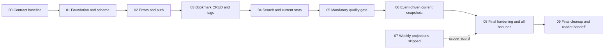

# Delivery Plan

## 1. Delivery strategy

Work is split into independently reviewable tracks. Each track has a narrow outcome, explicit dependencies, acceptance evidence, and a proposed commit boundary. Mandatory assessment requirements reach a complete quality gate before background statistics extensions begin.

This ordering is intentional:

Detailed execution artifacts may be created sequentially after upstream plan review
when that helps bound later work. Their presence does not authorize implementation:
each track remains dependency-gated until its upstream implementation and closure
evidence are complete. This preserves stable requirements and architectural decisions
in `.docs/` and `.tracks/ADR/` without treating planned detail as runtime readiness.

## 2. Working rules

Every track follows the same discipline:

1. Re-read its accepted requirements and ADRs.
2. Record scope, non-goals, dependencies, and acceptance evidence in the track `SPEC.md`.
3. Create a small ordered `PLAN.md` with one active item at a time.
4. Implement in reviewable increments.
5. Run focused validation after each meaningful write wave.
6. Inspect the diff for accidental scope expansion and security-sensitive output.
7. Record commands, outcomes, gaps, and decisions in `HISTORY.md` and `TEST-REPORT.md`.
8. Run the track closure gate and update the track index.

No track is considered complete based only on code presence. Completion requires behavioral evidence. The shared [engineering verification guideline](ENGINEERING-VERIFICATION-GUIDELINE.md) defines evidence receipts, status vocabulary, structured-log checks, and the required executable-track Bash-harness baseline.

## 3. Track overview

| Track | Outcome | Depends on | State |
| --- | --- | --- | --- |
| 00 | Confirmed contract, ADR set, traceability, architecture, and delivery control plane | Assessment and user decisions | Complete |
| 01 | Reproducible project foundation and migration-built constrained core schema | 00 | Complete |
| 02 | Consistent error model plus secure registration/login/auth dependencies | 01 | Complete |
| 03 | User-scoped bookmark CRUD with normalized many-to-many tags and timestamp invariants | 02 | Complete |
| 04 | Search/filter/pagination and correct raw-SQL current statistics | 03 | Complete |
| 05 | Mandatory OpenAPI, integration, N+1, and quality gate | 04 | Complete |
| 06 | Loosely coupled invalidations, durable dirty recovery, current snapshots, health, and logs | 05 | Complete |
| 07 | Weekly developing/developed points and append-only correction projections | None | **Skipped (owner decision)** |
| 08 | Full regression, documentation evidence, walkthrough readiness, and all bonuses | 01–06 plus 07 skip record | Complete |
| 09 | Cleanup, `.docs` migration, typed internal models/lifecycle events, and standalone final reports | 08 | **In progress** |

## 4. Track 00 — Contract and architecture baseline

### Outcome

Create a durable and internally consistent interpretation of the exercise before product implementation begins.

### Included

- preserve the supplied assessment in `.docs/`;
- extract a requirement-to-evidence matrix;
- record all confirmed choices and rejected alternatives in accepted ADRs;
- distinguish delivered current statistics from the owner-skipped weekly projection design;
- define system boundaries, runtime topology, data invariants, testing strategy, and delivery tracks;
- identify any remaining material ambiguity and ask before implementation.

### Acceptance evidence

- every assessment requirement has a stable identifier and track owner in [ASSESSMENT.md](ASSESSMENT.md);
- [SOLUTION-DESIGN.md](SOLUTION-DESIGN.md) links every accepted ADR;
- ADR-005 retains the weekly event-time/correction design as an archived option while
  the track records its implementation as skipped;
- the plan puts the complete mandatory gate before optional/extended runtime behavior;
- a reader can explain what is required, what is an extension, and how correctness will be demonstrated without consulting chat history.

### Proposed commit

`docs: establish assessment contract and solution design`

## 5. Track 01 — Foundation, configuration, and core schema

### Outcome

Produce a reproducible Python service skeleton and an Alembic-built SQLite core schema with enforced relationships and constraints.

### Included

- `pyproject.toml`, application package, test layout, and quality-tool configuration;
- typed Settings with development/test configuration and safe secret rules;
- SQLModel engine/session factory;
- per-connection SQLite foreign-key enablement, busy timeout, and reviewed pragmas;
- Alembic setup and first migration for users, bookmarks, tags, and `bookmark_tags`;
- clock abstraction and UTC serialization convention;
- minimal app factory/lifespan foundation;
- local commands for migrate, test, lint, type-check, and run.

### Non-goals

- auth endpoints;
- bookmark routes;
- statistics projection tables;
- background worker.

### Acceptance evidence

- a clean database is constructed by `alembic upgrade head`;
- migrations are the only application schema creation path;
- real inserts demonstrate foreign-key and unique-constraint enforcement;
- settings reject unsafe production secret configuration;
- lint, type checks, and foundation tests pass.

### Proposed commit

`build: establish application foundation and constrained schema`

## 6. Track 02 — Error contract and authentication

### Outcome

Provide secure identity creation and token authentication behind a uniform documented error surface.

### Included

- global domain, validation, authentication, and unexpected-error handlers;
- registration DTOs and username/email/password normalization;
- Argon2 hashing and verification;
- JWT creation/validation with configurable expiry;
- registration and login routes;
- authenticated-user dependency;
- OpenAPI bearer security scheme, response models, status codes, and examples.

### Acceptance evidence

- valid registration and login work end to end;
- normalized email/username conflicts return `409` in the standard envelope;
- invalid, expired, malformed, and missing tokens return consistent `401` responses;
- password hashes and tokens never appear in ordinary logs or response DTOs;
- auth route responses validate against generated OpenAPI schemas.

### Proposed commit

`feat: add secure authentication and error contracts`

## 7. Track 03 — Bookmark CRUD, tags, and isolation

### Outcome

Deliver complete protected bookmark CRUD with normalized many-to-many tags and rigorously tested ownership/timestamp behavior.

### Included

- separate table models and create/update/read DTOs;
- service/repository transaction boundary;
- create, get, patch, and delete routes;
- global tag canonicalization and association management;
- owner-scoped database queries;
- stable response ordering for tags;
- material-change detection with injected clock;
- extension seam for after-commit statistics invalidations, initially a no-op publisher.

### Acceptance evidence

- CRUD success and failure paths match documented schemas and statuses;
- another user's bookmark is indistinguishable from a missing bookmark;
- duplicate URLs remain allowed;
- tag trimming, lowercasing, deduplication, reuse, and orphan retention behave as specified;
- `created_at` and `updated_at` start equal;
- material scalar and tag changes advance only `updated_at`;
- empty, identical, reordered-tag, failed, and rolled-back updates do not advance it;
- deletion returns a bodyless `204`.

### Proposed commit

`feat: implement isolated bookmark CRUD and normalized tags`

## 8. Track 04 — Search, pagination, and current raw-SQL statistics

### Outcome

Complete all remaining core functional behavior, including the assessment-mandated raw SQL statistics endpoint.

### Included

- title keyword and exact normalized tag filtering;
- created and updated inclusive UTC calendar-date filters;
- page/page-size validation, total count, and deterministic ordering;
- eager loading/query design that avoids N+1;
- raw SQL current statistics implementation;
- configurable top-tag limit and deterministic tie handling;
- authenticated, user-scoped `/api/bookmarks/stats` response.

### Acceptance evidence

- combined filters and totals are correct;
- date upper bounds use next-midnight-exclusive semantics;
- stable ordering prevents duplicate/missing items across page boundaries;
- list query count remains bounded as result size grows;
- raw SQL returns correct empty and populated results for each user;
- total tags count only attached distinct tags;
- top-tag ties and monthly ordering are deterministic;
- ordinary CRUD code contains no raw SQL.

### Proposed commit

`feat: add bookmark discovery and raw SQL statistics`

## 9. Track 05 — Mandatory quality and contract gate

### Outcome

Reach a demonstrably complete assessment solution before beginning the background-processing extension.

### Included

- complete OpenAPI metadata and representative examples;
- real response-instance validation against generated OpenAPI schemas;
- broad integration coverage across auth, isolation, CRUD, tags, filters, pagination, statistics, errors, and migrations;
- query-count regression tests;
- at least ten meaningful tests, with a target substantially above that minimum;
- clean lint, format, type-check, and full test runs;
- a runnable mandatory-core checkpoint.

### Acceptance evidence

- the assessment traceability matrix has passing evidence for every mandatory functional requirement;
- `/docs` exposes accurate bearer auth, schemas, examples, parameters, statuses, and errors;
- runtime success and error responses validate against the generated OpenAPI document;
- the full mandatory suite passes from a clean migration-built database;
- no known critical or high-severity defect remains.

### Stop condition

Do not start Track 06 if a mandatory requirement is failing or lacks evidence. Extension work may not mask an incomplete core solution.

### Proposed commit

`test: enforce mandatory API and OpenAPI quality gate`

## 10. Track 06 — Event-driven current statistics service

### Outcome

Add the loose-coupled runtime requested by the user while retaining live raw-SQL correctness fallback.

### Included

- `BookmarkStatsInvalidated` DTO and publisher protocol;
- bounded in-process queue implementation;
- migration for the durable dirty-window marker;
- same-transaction dirty-generation increment for material bookmark mutations;
- publish-after-commit integration for material bookmark mutations;
- FastAPI lifespan-managed named refresher thread;
- configurable ten-second default batching cadence;
- event coalescing and canonical current-stat recomputation;
- generation-safe marker cleanup and startup/overflow recovery;
- atomic immutable snapshot publication;
- live raw-SQL fallback for missing, stale, disabled, or unhealthy snapshots;
- `/health/live` and `/health/ready`;
- service/thread-attributed structured logs and redaction tests.

### Acceptance evidence

- every successful material action publishes once after commit;
- no-op and rolled-back actions publish nothing;
- every material mutation commits its dirty marker before post-commit publication;
- the event contains no bookmark content or credential data;
- burst invalidations coalesce without incorrect counter arithmetic;
- snapshot swaps never expose partially updated objects;
- disabling or failing the refresher leaves the current endpoint correct through live SQL;
- a dropped or overflowed event is recovered from durable dirty state;
- a concurrent invalidation cannot be erased by an older worker generation;
- lifecycle tests prove named-thread start, cooperative stop, and restart isolation;
- readiness degrades on a dead, stuck, or repeatedly failing refresher when enabled.

### Proposed commit

`feat: add observable event-driven statistics refresh`

## 11. Track 07 — Skipped weekly projection and correction revisions

### Outcome

Record the owner decision not to implement weekly developing/developed points or
append-only corrections.

### Included

- explicit Skipped status in SPEC, PLAN, HISTORY, indexes, and reader docs;
- no weekly migration, table, consumer, backfill, route, or worker extension;
- terminal Track 06 current-only generation completion;
- Track 08 dependency on the skip record rather than Track 07 closure evidence.

### Acceptance evidence

- documentation verification confirms the explicit skip everywhere current scope is described;
- no Track 07 product artifact or `scripts/verify-track-07.sh` exists;
- Track 08 does not require a Track 07 `TEST-REPORT.md`;
- current `/api/bookmarks/stats` remains the only statistics surface.

### Proposed commit

No implementation commit. The scope decision is documentation-only.

## 12. Track 08 — Final hardening, documentation, and handoff

### Outcome

Turn the working solution into a concise, reproducible senior-level submission with honest evidence.

### Included

- full clean-environment regression and migration rehearsal;
- README quickstart, commands, API usage, examples, architecture, design choices, tradeoffs, and limitations;
- generated or verified OpenAPI artifact if useful for review;
- final test report with requirement-to-evidence links;
- AI-assisted-development disclosure and process narrative based on actual work history;
- walkthrough/demo script;
- deterministic seed command, Docker setup, rate limiting, and cursor pagination,
  each after the mandatory gate with isolated evidence;
- bounded security/dependency review and cleanup.

### Acceptance evidence

- a reviewer can clone, configure, migrate, run, and test the service using documented commands;
- one bootstrap starts the API and in-process services with attributable logs;
- README claims agree with code and test evidence;
- all mandatory and accepted extension requirements have traceable passing evidence;
- known limitations and production evolution are explicit;
- git history is coherent and free of generated noise or secrets;
- seed behavior is deterministic/idempotent and does not expose credentials;
- Docker migration/start/health/shutdown works from a clean environment;
- rate limiting has deterministic 429, isolation, and recovery evidence;
- cursor pagination has stable ordering, boundary, malformed/tampered cursor, and
  owner-isolation evidence;
- no bonus weakens the core solution and the combined final harness remains green.

### Proposed commits

- `docs: add reproducible setup and engineering walkthrough`
- `feat: add deterministic sample data seeding`
- `build: add reproducible Docker workflow`
- `feat: add bounded API rate limiting`
- `feat: add cursor pagination`

## 13. Track 09 — Final cleanup, documentation migration, and reports

### Outcome

Finish the repository as a fresh-reader-friendly assessment without changing the
accepted HTTP, persistence, security, statistics, one-worker, or Track 07 absence
contracts. This track remains **in progress** until its clean-source and Docker gates
have actual passing receipts.

### Included

- move reader documentation to `.docs` and make root `README.md` the first-stop guide;
- replace internal/test-helper dataclasses with strict Pydantic v2 models while retaining
  frozen/mutable, invariant, equality/hash, cursor, and concurrency behavior;
- use a lifecycle `StrEnum`, retain FastAPI's current lifespan pattern, pin standard-mode
  Pyright, and document narrow SQLModel typing boundaries;
- migrate TestClient support to `httpx2` with a public Schemathesis compatibility adapter;
- make verification scripts print standalone reports and require ordered Docker evidence.

### Acceptance evidence

- the unchanged OpenAPI inventory remains 10 operations and 45 status pairs, and the
  requirement map remains 43 IDs;
- all eight accepted ADRs and Tracks 00–09 are accurately indexed;
- current in-progress evidence reports 740 tests plus 3 subtests and 2,953 statements /
  618 branches at 100%, without claiming final closure;
- `verify-docs`, Tracks 01–06, Track 08, and the new Track 09 gate emit standalone
  terminal reports; Track 07 remains owner-skipped and has no verifier;
- a dirty/non-clean source fails; explicit development seams and unavailable Docker are
  nonzero incomplete, never a pass or skip; final Track 09 and merged-main evidence is
  still required.

### Proposed commit

`docs: make README the first-stop Track 09 guide`

## 14. Cross-track acceptance matrix

| Quality attribute | Primary tracks | Closure evidence |
| --- | --- | --- |
| Functional completeness | 02–05 | Integration and contract suite mapped to requirement IDs. |
| Data integrity | 01, 03, 06 | Migration tests, real constraint failures, transaction/concurrency tests. |
| Security and isolation | 02, 03, 08 | Auth, ownership, secret-validation, redaction, and review evidence. |
| API usability | 02–05, 08 | Accurate OpenAPI, examples, consistent errors, README usage. |
| Performance discipline | 04, 06 | Bounded pagination, query-count tests, coalescing, bounded queue. |
| Reliability | 06, 08 | Fallback path, lifecycle, durable recovery, bonus edge cases, and readiness. |
| Maintainability | all | Layer boundaries, accepted ADRs, typed code, focused commits. |
| Reviewer experience | 00, 05, 08 | Traceability, clean bootstrap, walkthrough, honest limitations. |

## 15. Risk register

| Risk | Mitigation | Track proving it |
| --- | --- | --- |
| SQLite foreign keys declared but not enforced | Per-connection pragma plus real failure tests. | 01 |
| Persistence models leak into API schemas | Separate table models and DTOs. | 03, 05 |
| `updated_at` changes on no-op or fails to change on tag update | Material-change comparison and injected clock matrix. | 03 |
| User data leaks through ID lookup or statistics | Owner predicates in repositories/raw SQL and two-user tests. | 03, 04 |
| OpenAPI exists but is inaccurate | Validate real response instances against generated schemas. | 05 |
| Background thread creates a second source of truth | Canonical recomputation and live raw-SQL fallback. | 06 |
| In-process event loss leaves stale current work | Durable dirty generation in mutation transaction. | 06 |
| Worker deletes a newly dirtied marker | Generation compare-and-delete. | 06 |
| Skipped weekly scope is accidentally reintroduced | Documentation verifier and Track 08 absence audit reject weekly artifacts. | 07, 08 |
| Bonus work regresses the mandatory API | Isolated bonus commits plus full final harness after all bonuses. | 08 |
| Extension consumes time while mandatory API is incomplete | Hard Track 05 gate before Track 06. | 05 |
| Documentation overstates the implementation | Write final README process/evidence from verified repository state. | 08 |

## 16. Definition of done

The project is done only when:

- every mandatory assessment requirement has passing evidence;
- all eight accepted ADRs are implemented, adopted as governance constraints, archived
  by an explicit owner skip, or explicitly superseded;
- current statistics remain correct and weekly historical projections remain explicitly skipped;
- the application bootstraps locally with all internal services visible in logs;
- migrations, lint, type checks, tests, OpenAPI conformance, and representative runtime smoke tests pass;
- all selected Track 08 bonuses have their recorded evidence, and Track 09's final
  clean-source/Docker/report gate has actual passing evidence;
- documentation describes the actual implementation, including tradeoffs and known limits;
- no unresolved material ambiguity, secret, or high-severity defect remains.
