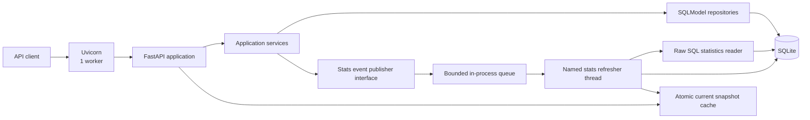
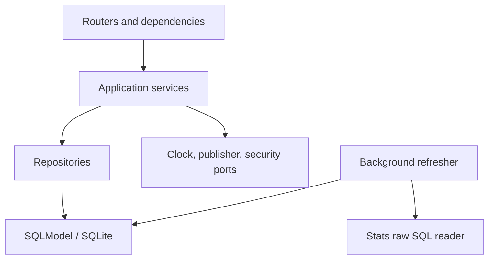
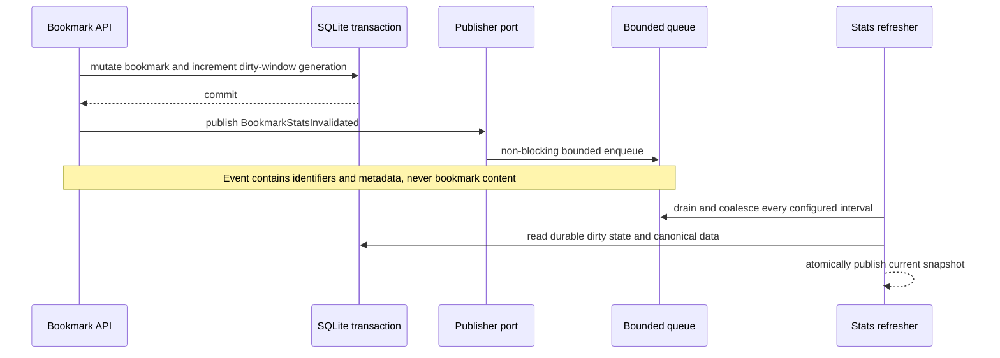

# Solution Design

## 1. Purpose

This document describes the delivered local solution for the Bookmarks API assessment. It maps [ASSESSMENT.md](ASSESSMENT.md) and the accepted decisions in [the ADR index](../.tracks/README.md#architecture-decisions) to the current implementation and its in-progress final verification.

The design has two layers:

1. the mandatory assessment solution: authenticated bookmark management, search, pagination, and a raw-SQL current-statistics endpoint;
2. a deliberately bounded engineering extension: loosely coupled invalidation events,
   a background current-statistics refresher, private weekly event-time projections
   with append-only corrections, and health reporting. Weekly history remains private.

The mandatory API remains correct without the extension. The extension must improve freshness and observability without becoming the sole path to correct responses.

## 2. Design goals

The solution optimizes for:

- correctness and explicit invariants over framework cleverness;
- a small, locally runnable architecture appropriate to a take-home exercise;
- clear separation between HTTP, application, persistence, and background-processing concerns;
- deterministic behavior that is straightforward to test;
- visible database constraints rather than validation that exists only in Python;
- an accurate OpenAPI contract with representative examples;
- recoverability when an in-process event is lost or the background thread restarts;
- an evolutionary path to a production deployment without pretending SQLite and an in-process queue are production infrastructure.

## 3. System context



The FastAPI lifespan owns the background refresher. Starting the backend through the project bootstrap command starts the HTTP service and all in-process supporting services together. Structured logs identify the emitting service and thread so their output remains distinguishable in one terminal.

The deployment uses one Uvicorn worker. The queue, cache, and worker health state are process-local; multiple web workers would create divergent state and are therefore rejected for this implementation. [ADR-004](../.tracks/ADR/ADR-004-event-driven-statistics-service.md) records that constraint and the production evolution path.

## 4. Technology stack

| Concern | Choice | Rationale |
| --- | --- | --- |
| Language | Python 3.12 | Modern supported runtime while satisfying the assessment's Python requirement. |
| HTTP framework | FastAPI | Strong request validation, dependency injection, and generated OpenAPI. |
| ORM and models | SQLModel, synchronous sessions | Requested stack; appropriate complexity for SQLite and a take-home service. |
| Database | SQLite | Local, zero-infrastructure execution as recommended by the exercise. |
| Migrations | Alembic | Versioned, reviewable schema changes; no runtime `create_all()`. |
| Authentication | PyJWT with HS256 access tokens | Small, explicit JWT surface without an unnecessary identity subsystem. |
| Password hashing | `pwdlib[argon2]` | Modern password hashing with library-managed parameters. |
| Validation/settings | Pydantic v2 through FastAPI and `pydantic-settings` | Typed transport boundaries, strict internal value models, and environment-driven configuration. |
| Tests | pytest, `httpx2` TestClient, Schemathesis adapter, temporary SQLite databases | Deterministic unit/integration/contract tests while preserving public response validation. |
| Quality | Ruff, mypy, pinned standard-mode Pyright, pytest coverage | Formatting/linting, typed application boundaries, and observable test coverage. |
| Packaging | `pyproject.toml` | One source for dependencies and tool configuration. |

The complete stack and its boundaries are accepted in [ADR-001](../.tracks/ADR/ADR-001-application-stack-and-data-access.md).

### Decision map

- [ADR-001](../.tracks/ADR/ADR-001-application-stack-and-data-access.md) defines the FastAPI, SQLModel, SQLite, Alembic, and raw-SQL boundary.
- [ADR-002](../.tracks/ADR/ADR-002-api-contract-and-timestamps.md) defines API, filtering, tag, and timestamp semantics.
- [ADR-003](../.tracks/ADR/ADR-003-identity-and-token-security.md) defines identity, password hashing, and JWT handling.
- [ADR-004](../.tracks/ADR/ADR-004-event-driven-statistics-service.md) defines current-statistics invalidation, snapshots, health, and one-worker runtime constraints.
- [ADR-005](../.tracks/ADR/ADR-005-windowed-statistics-data-points.md) defines the delivered private weekly-projection and correction design.
- [ADR-006](../.tracks/ADR/ADR-006-engineering-verification-and-closure-evidence.md) defines the binding evidence and closure process.
- [ADR-007](../.tracks/ADR/ADR-007-local-rate-limiting-and-cursor-pagination.md) defines local rate limiting and authenticated cursor pagination.
- [ADR-008](../.tracks/ADR/ADR-008-pydantic-internal-models-and-lifecycle-events.md) defines strict internal Pydantic models and typed lifecycle events.
- [ADR-009](../.tracks/ADR/ADR-009-track-07-weekly-projection-revival.md) revives Track 07 while preserving current-statistics and one-worker invariants.

## 5. Code organization

The application is a modular monolith. Modules group code by capability, while shared infrastructure stays small and explicit.

```text
app/
├── main.py
├── api/
│   ├── errors.py
│   ├── health.py
│   └── rate_limit.py
├── core/
│   ├── clock.py
│   ├── config.py
│   ├── errors.py
│   └── logging.py
├── db/
│   ├── engine.py
│   └── models.py
├── auth/
│   ├── dependencies.py
│   ├── identity.py
│   ├── models.py
│   ├── repository.py
│   ├── router.py
│   ├── schemas.py
│   ├── security.py
│   └── service.py
└── bookmarks/
    ├── dependencies.py
    ├── events.py
    ├── models.py
    ├── pagination.py
    ├── policy.py
    ├── repository.py
    ├── router.py
    ├── schemas.py
    ├── service.py
    └── stats/
        ├── dirty.py
        ├── publisher.py
        ├── raw_sql.py
        ├── refresher.py
        ├── schemas.py
        ├── service.py
        └── snapshots.py
alembic/
tests/
├── contract/
├── integration/
└── unit/
```

The delivered file split is shown above. The dependency direction is:



- Routers translate HTTP input/output and declare OpenAPI metadata. They do not contain business transactions.
- Services enforce ownership, normalization, material-change rules, and transaction boundaries.
- Repositories query and mutate persistence state but do not commit independently.
- SQLModel table models and API DTOs are separate types so persistence changes do not accidentally change the public contract.
- Raw SQL is isolated to `bookmarks/stats/raw_sql.py` and clearly commented as the assessment-mandated exception. Ordinary CRUD uses SQLModel ORM operations.

## 6. HTTP API

All bookmark and statistics routes require a bearer access token and are scoped to the authenticated user.

| Method | Path | Success | Purpose |
| --- | --- | --- | --- |
| `POST` | `/api/auth/register` | `201` | Create a user account. |
| `POST` | `/api/auth/login` | `200` | Exchange credentials for an access token. |
| `POST` | `/api/bookmarks` | `201` | Create a bookmark and attach normalized tags. |
| `GET` | `/api/bookmarks` | `200` | Search, filter, sort, and paginate the user's bookmarks. |
| `GET` | `/api/bookmarks/stats` | `200` | Return required all-current statistics using raw SQL. |
| `GET` | `/api/bookmarks/{bookmark_id}` | `200` | Read one owned bookmark. |
| `PATCH` | `/api/bookmarks/{bookmark_id}` | `200` | Partially update one owned bookmark. |
| `DELETE` | `/api/bookmarks/{bookmark_id}` | `204` | Delete one owned bookmark. |
| `GET` | `/health/live` | `200` | Report whether the process can serve requests. |
| `GET` | `/health/ready` | `200` or `503` | Report database and required internal-service readiness. |

The static `/stats` route must be registered before `/{bookmark_id}` to avoid path ambiguity.

### 6.1 Response and error contracts

Every operation defines its response model, success status, security requirement, error responses, and examples in OpenAPI. Validation, authentication, conflict, and not-found failures use one envelope:

```json
{
  "error": {
    "code": "bookmark_not_found",
    "message": "Bookmark was not found",
    "details": null
  }
}
```

Expected statuses include:

- `401` for missing, malformed, expired, or otherwise invalid credentials;
- `404` both for a missing bookmark and another user's bookmark, preventing ownership disclosure;
- `409` for uniqueness conflicts such as an existing username or email;
- `422` for request validation;
- `204` with no body for successful deletion.

[ADR-002](../.tracks/ADR/ADR-002-api-contract-and-timestamps.md) owns the API and timestamp semantics.

### 6.2 Search and pagination

`GET /api/bookmarks` supports:

- `tag`: exact match after the same normalization used on writes;
- `q`: case-insensitive substring match against title only;
- `from` and `to`: inclusive UTC calendar dates applied to `created_at`;
- `updated_from` and `updated_to`: inclusive UTC calendar dates applied to `updated_at`;
- `page`: one-based page number, default `1`;
- `page_size`: default `20`, maximum `100`.

An inclusive upper calendar date is implemented as `< next UTC midnight`; it is not converted to `23:59:59.999999`. Results use deterministic ordering by `created_at DESC, id DESC`. The response contains both items and total count calculated from the same filters.

Repository queries must eager-load tags or use a deliberate joined/select-in strategy. Tests include query-count protection for list and statistics paths so later refactors do not introduce N+1 behavior.

## 7. Domain and persistence model

```mermaid
erDiagram
    USER ||--o{ BOOKMARK : owns
    BOOKMARK ||--o{ BOOKMARK_TAG : has
    TAG ||--o{ BOOKMARK_TAG : labels
    USER ||--o{ STATS_DIRTY_WINDOW : invalidates

    USER {
        int id PK
        string email UK
        string username UK
        string password_hash
        datetime created_at
    }
    BOOKMARK {
        int id PK
        int user_id FK
        string url
        string title
        string description
        datetime created_at
        datetime updated_at
    }
    TAG {
        int id PK
        string name UK
    }
    BOOKMARK_TAG {
        int bookmark_id PK_FK
        int tag_id PK_FK
    }
    STATS_DIRTY_WINDOW {
        int user_id PK_FK
        datetime window_start PK
        int generation
        string reason
        datetime first_marked_at
        datetime last_marked_at
    }
```

The initial core migration contains users, bookmarks, tags, and `bookmark_tags`. The
durable dirty-window table arrives with the Track 06 event service. Track 07 adds
private `bookmark_stats_window_working`, append-only `bookmark_stats_window_point`, and
restartable `bookmark_stats_projection_state` persistence plus dual current/projection
generation completion.

Important constraints and indexes include:

- case-normalized unique `user.email` and `user.username`;
- an 80-character maximum for usernames;
- required bookmark URL and title, with title limited to 200 characters and optional description limited to 500 characters;
- global unique normalized `tag.name`;
- a 50-character maximum for normalized tag names;
- a composite primary key on `bookmark_tags(bookmark_id, tag_id)`;
- `ON DELETE CASCADE` from user to owned bookmarks and from bookmark/tag parents to association rows;
- indexes supporting `bookmarks(user_id, created_at, id)` and `bookmarks(user_id, updated_at, id)`;
- an index supporting case-insensitive title lookup where SQLite's query plan benefits from it;
- a composite `(user_id, window_start)` dirty-marker key with generation-safe cleanup.
- one working row per user/window, immutable point revisions with a same-window
  immediate-predecessor foreign key, and a singleton restartable baseline checkpoint;
- user-delete cascades across dirty, working, and point rows without synthesizing
  deleted-user history.

Every SQLite connection executes `PRAGMA foreign_keys=ON`. Tests prove actual constraint failures; schema declarations alone are not accepted as evidence. Alembic is the only application schema-creation mechanism.

### 7.1 Normalization rules

- Email: trim, validate, lowercase, then persist.
- Username: trim, lowercase, restrict to ASCII, length 3–80.
- Password: length 15–128, Unicode and spaces allowed, NFC-normalized, no arbitrary composition rule.
- Bookmark URL: valid absolute HTTP or HTTPS URL. Duplicate URLs are allowed.
- Tag name: trim, lowercase, reject empty values, remove duplicates while preserving a deterministic response order.

Tags are globally canonical. Deleting or detaching a bookmark does not automatically remove the tag row itself; only its association rows cascade. `total_tags` counts distinct tags currently attached to that user's bookmarks.

## 8. Authentication and authorization

Registration hashes the password with Argon2 and never exposes the stored hash. Login returns a bearer access token containing a subject that resolves to the user, issued-at time, and expiration. The default lifetime is 30 minutes and is configurable.

The signing secret must come from application settings. Development and test fixtures may inject a known secret, but production-mode configuration has no usable default. Authentication performs one consistent failure response so callers cannot use it for user enumeration.

Authorization is query-scoped: repository methods select bookmarks by both bookmark identifier and authenticated user identifier. A service must not fetch an arbitrary bookmark and then remember to compare ownership afterward.

These decisions are recorded in [ADR-003](../.tracks/ADR/ADR-003-identity-and-token-security.md).

## 9. Timestamp semantics

All persisted timestamps are UTC-aware at the application boundary and stored in a representation with an explicit serialization policy.

On creation, the service obtains one clock value and assigns it to both `created_at` and `updated_at`. `created_at` is immutable. `updated_at` advances only after a successful material change to a scalar field or tag membership.

The following do not advance `updated_at`:

- an empty PATCH;
- a PATCH whose normalized values equal the current values;
- tags supplied in a different order but with the same normalized membership;
- a validation failure, conflict, or rolled-back transaction.

Tests inject a controllable clock and compare exact instants. They do not sleep or rely on the host clock's resolution.

## 10. Current statistics: mandatory contract

`GET /api/bookmarks/stats` is an all-current, user-scoped view. Its result represents canonical bookmark and tag state at request time, not a weekly historical point.

```json
{
  "total_bookmarks": 12,
  "total_tags": 7,
  "top_tags": [
    {"name": "python", "count": 5}
  ],
  "bookmarks_per_month": [
    {"month": "2026-08", "count": 4}
  ]
}
```

Semantics:

- `total_bookmarks`: number of the user's current bookmarks;
- `total_tags`: number of distinct tags currently attached to those bookmarks;
- `top_tags`: tags ordered by bookmark count descending and normalized name ascending, limited by `TOP_TAGS_LIMIT` (default `5`);
- `bookmarks_per_month`: current bookmarks grouped by their immutable `created_at` UTC month and ordered chronologically.

The public field name is `count` in both aggregate item types, matching the assessment example. Internal SQL aliases and DTOs must preserve that exact response contract.

The canonical computation is parameterized raw SQL with the user identifier bound as a parameter. It must not interpolate user input into SQL. This is the only required raw-SQL API path.

The extension may serve an atomically published in-memory snapshot when it is known fresh. If that snapshot is missing, stale, disabled, or the refresher is unhealthy, the request computes the result live from canonical tables. Correctness therefore never depends solely on an in-process cache.

## 11. Loose-coupled statistics invalidation

Each successful material bookmark create, update, tag change, or delete produces a statistics invalidation. The domain service depends on a publisher interface, not on `queue.Queue` or the refresher implementation.



The event contains:

- user identifier;
- affected UTC weekly window start;
- mutation kind;
- bookmark/resource identifier;
- occurrence time;
- correlation identifier.

It contains no URL, title, description, tag text, password data, or token. Events are invalidations, not arithmetic deltas. Recalculation from canonical state avoids error-prone increment/decrement logic when updates and retries coalesce.

### 11.1 Transaction and publication rule

The mutation and durable dirty-window generation increment occur in the same database transaction. The in-process event publishes only after that transaction commits. A rollback publishes nothing.

The queue is an acceleration signal, while the dirty table is the recovery source. Queue overflow is logged and measured but does not corrupt durable state. On startup and every cycle, the refresher can discover dirty work without receiving the original event.

### 11.2 Background refresher

FastAPI lifespan starts one named, non-daemon thread: `bookmark-stats-refresher`. It stops cooperatively through an event and is joined during application shutdown. It owns no request-scoped objects and opens a new SQLModel session for each cycle.

Every `STATS_REFRESH_INTERVAL_SECONDS` (default `10`) it:

1. drains queued invalidations up to configured limits;
2. reads durable dirty markers;
3. coalesces current-statistics work by user and durable markers by `(user_id, window_start)`;
4. computes canonical results using the raw SQL reader;
5. atomically swaps immutable current snapshot objects;
6. removes a dirty marker only if the generation still equals the value observed at cycle start;
7. records cycle timing, success, and failure state.

Generation comparison prevents a concurrent mutation from being erased by an older refresh cycle.

## 12. Private weekly event-time projection

Track 07 implements UTC Monday-to-Monday event-time windows without adding a public
history endpoint. A restartable, bounded baseline scans surviving canonical bookmark
data: closed evidenced windows receive revision 1 with `source_generation=0`, while
the current evidenced window receives one replaceable working row. Empty elapsed weeks
and deleted pre-install data are not fabricated.

The existing named non-daemon `bookmark-stats-refresher` performs projection work only
after the current-statistics transaction closes and uses independent short sessions.
Observed positive dirty generations replace current working state or append a changed
late correction to a closed window. Developed rows are immutable; a correction points
to the immediate predecessor for the same user/window, same-hash replay is a no-op,
and A-B-A material changes remain visible as distinct revisions.

Canonical compact UTF-8 JSON includes an explicit payload schema. A domain-separated
SHA-256 binds those bytes to the calculation version and top-tag limit. A stored/runtime
version mismatch never rewrites history automatically: it degrades readiness while
liveness and `/api/bookmarks/stats` remain correct. `STATS_PROJECTION_ENABLED=false`
likewise retains durable work and degrades readiness without changing the public body.

[ADR-005](../.tracks/ADR/ADR-005-windowed-statistics-data-points.md) defines the data
semantics and [ADR-009](../.tracks/ADR/ADR-009-track-07-weekly-projection-revival.md)
records the revival and compatibility boundary.

## 13. Configuration

Application settings are environment-driven, validated once, and injectable in tests. Expected settings include:

| Setting | Default / policy | Purpose |
| --- | --- | --- |
| `APP_ENV` | `development` | Environment-specific validation and logging behavior. |
| `DATABASE_URL` | local SQLite file | Database location. |
| `JWT_SECRET` | required outside test/dev fixture | Token signing secret. |
| `ACCESS_TOKEN_TTL_MINUTES` | `30` | Access-token lifetime. |
| `TOP_TAGS_LIMIT` | `5` | Number of top tags in current stats. |
| `STATS_REFRESH_ENABLED` | `true` | Enable the background refresher. |
| `STATS_PROJECTION_ENABLED` | `true` | Enable private weekly projection processing in the existing refresher. |
| `STATS_REFRESH_INTERVAL_SECONDS` | `10` | Maximum normal batching delay. |
| `STATS_EVENT_QUEUE_CAPACITY` | `1000` | Protect memory under event bursts. |
| `STATS_STALE_AFTER_SECONDS` | `30`, at least the interval | Decide whether cached current stats are fresh enough. |
| `STATS_INITIAL_REFRESH_TIMEOUT_SECONDS` | `5` | Bound initial reconciliation waiting. |
| `STATS_SHUTDOWN_TIMEOUT_SECONDS` | `5` | Bound cooperative thread join. |
| `STATS_FULL_RECONCILIATION_SECONDS` | `300`, at least the interval | Periodic defense-in-depth reconciliation. |
| `STATS_DIRTY_MAX_AGE_SECONDS` | `60`, at least the interval | Detect stalled durable work. |
| `STATS_DIRTY_MAX_COUNT` | `1000` | Bound a healthy dirty backlog. |
| `APP_WORKER_COUNT` | `1` in this runtime | Reject divergent process-local queue/cache state. |
| `RATE_LIMIT_ENABLED` | `true`; required in production | Enable the local process limiter. |
| `RATE_LIMIT_AUTH_REQUESTS` / `RATE_LIMIT_AUTH_WINDOW_SECONDS` | `10` / `60` | Shared registration/login peer-IP bucket. |
| `RATE_LIMIT_BOOKMARK_REQUESTS` / `RATE_LIMIT_BOOKMARK_WINDOW_SECONDS` | `120` / `60` | Shared authenticated-user bookmark bucket. |
| `RATE_LIMIT_MAX_KEYS` / `RATE_LIMIT_IDLE_TTL_SECONDS` | `10000` / `300` | Bound retained local bucket state. |
| `CURSOR_TTL_SECONDS` | `900` | Signed owner/filter-bound cursor lifetime. |
| `SQLITE_BUSY_TIMEOUT_MILLISECONDS` | `5000` | SQLite connection busy timeout. |
| `LOG_LEVEL` | `INFO` | Runtime logging threshold. |

Settings whose meaning depends on the refresh interval are validated together. For example, `STATS_STALE_AFTER_SECONDS` must not be shorter than a healthy refresh cycle. Rate-limit idle retention must be at least both windows; rate limiting and refresh both require one worker. ADR-007 governs cursor and rate-limit behavior.

## 14. Health and observability

`/health/live` reports process liveness and remains simple. `/health/ready` verifies the database and, when statistics refresh is enabled, evaluates service health rather than merely calling `thread.is_alive()`.

Readiness considers:

- thread existence and liveness;
- whether a refresh cycle is stuck or overdue;
- time of last successful cycle;
- consecutive failures;
- queue depth and overflow count;
- durable dirty backlog size and oldest age;
- durable dirty backlog thresholds.

Structured application logs include at least:

- `service`;
- `event`;
- `level`;
- `thread_name`;
- process identifier and application instance identifier;
- correlation/request identifier where applicable;
- duration and aggregate counts where useful.

They exclude passwords, password hashes, bearer tokens, complete URLs, bookmark text, and tag content. Startup logs make the API and refresher identities visible in the same output stream.

The shared [engineering verification guideline](ENGINEERING-VERIFICATION-GUIDELINE.md) defines common evidence, log-capture, and process-harness expectations. Worker-specific log fields and events remain authoritative in [ADR-004](../.tracks/ADR/ADR-004-event-driven-statistics-service.md).

## 15. Concurrency and SQLite behavior

The service is intentionally synchronous. Request handlers and the background thread each use their own short-lived sessions. SQLModel sessions are never shared across threads.

SQLite write contention is managed by:

- small transactions;
- a configured busy timeout;
- WAL mode where supported by the local runtime;
- one web worker and one background writer;
- bounded batch sizes;
- no long-running transaction while sleeping or waiting on the queue.

The design does not claim exactly-once event processing. It provides at-least-eventual
current-statistics recomputation from durable invalidations.

## 16. Test architecture

Tests are organized by the behavior they prove, not only by source file.

### 16.1 Unit tests

- normalization and validation;
- password hashing/token expiry and invalid-token handling;
- controllable-clock timestamp rules;
- UTC dirty-window normalization;
- material-change detection;
- event redaction and coalescing;
- settings cross-validation.

### 16.2 Integration tests

- migrations build an empty database;
- SQLite foreign keys are actually enforced;
- registration/login and protected-route behavior;
- user isolation including indistinguishable `404` behavior;
- bookmark CRUD and many-to-many tag persistence;
- search/date filters, totals, pagination, and deterministic ordering;
- raw SQL statistics semantics and tie ordering;
- no-op, material, failed, and tag-only `updated_at` cases;
- event publication occurs only after successful commit;
- queue overflow still leaves durable work recoverable;
- worker restart replays dirty work;
- generation-safe cleanup under a concurrent invalidation;
- private weekly baseline, working, correction, restart, and version-mismatch behavior
  with explicit absence of a public weekly/history route or second worker;
- readiness degradation and recovery.

### 16.3 Contract tests

The mandatory gate includes at least ten meaningful tests and must verify real response instances against the generated OpenAPI document. Contract tests cover success and error responses, pagination envelopes, authentication requirements, documented examples, and the bodyless `204` response.

The OpenAPI test should fail when runtime serialization and the published schema diverge. It must not merely assert that `/openapi.json` is reachable.

### 16.4 Quality gates

Each track runs its focused tests. Stable checkpoints run:

```text
ruff format --check .
ruff check .
mypy app
pytest
alembic upgrade head
```

The final validation also starts the application through the documented bootstrap, exercises representative HTTP flows, verifies health transitions, and rebuilds a database from migrations.

Executable-track Bash harnesses supplement these tests as defined by the [engineering verification guideline](ENGINEERING-VERIFICATION-GUIDELINE.md); they do not replace deterministic unit or contract coverage.

## 17. Bootstrap and operator experience

The repository exposes `make bootstrap`, which:

1. validate required settings;
2. apply Alembic migrations explicitly;
3. launch Uvicorn with one worker;
4. let FastAPI lifespan start the named refresher thread;
5. emit service-attributed startup logs;
6. stop the refresher cooperatively on shutdown.

Direct `uvicorn` execution remains possible for development, but it does not silently
create schema. Track 08 delivered a reproducible Docker workflow and its final
clean-source verification passed.

## 18. Security considerations

- Validate all input before persistence.
- Parameterize raw SQL and scope every statistics query by user.
- Use Argon2 password hashing and constant-style authentication failures.
- Require a non-default JWT secret outside explicit development/test contexts.
- Never return or log password hashes or access tokens.
- Apply ownership in database predicates.
- Bound page size, queue size, batch size, and token lifetime.
- Configure CORS narrowly if it is enabled at all.
- Avoid exposing SQLite paths or stack traces through error details.
- Keep dependency versions reviewable and run dependency/security checks where locally available.

Track 08 has delivered rate limiting, cursor pagination, and deterministic seed data.
Rate limiting is bounded and ownership-safe with an exact documented 429 contract.
Cursor pagination preserves deterministic ordering, owner isolation, and
malformed/tampered cursor handling while retaining page-pagination compatibility.
Seed data is idempotent and contains no real credentials. Final combined evidence
for these delivered boundaries passed.

[ADR-007](../.tracks/ADR/ADR-007-local-rate-limiting-and-cursor-pagination.md)
fixes those bonus contracts: socket-peer auth buckets, authenticated-user bookmark
buckets, bounded process-local state under the one-worker invariant, and signed,
owner/filter-bound keyset cursors while legacy page responses remain unchanged.

## 19. Evolution beyond the exercise

The local architecture makes its replacement seams visible:

| Local implementation | Production evolution |
| --- | --- |
| SQLite | PostgreSQL with database-native timestamp and indexing support. |
| In-process queue | Durable broker or transactional outbox plus consumer. |
| One named thread | Independently deployed statistics worker. |
| Process-local snapshot cache | Redis or persisted materialized view. |
| One Uvicorn worker | Horizontally scaled stateless API workers. |
| HS256 shared secret | Managed keys, asymmetric signing, rotation, issuer/audience policies. |
| Local structured logs | Central logs, metrics, traces, alerting, and SLOs. |

The goal is not to simulate distributed infrastructure in a take-home. It is to keep application interfaces and invariants strong enough that an appropriate production component can replace each local mechanism.

## 20. Decision map

| Decision | ADR |
| --- | --- |
| FastAPI, synchronous SQLModel, SQLite, Alembic, ORM/raw-SQL boundary | [ADR-001](../.tracks/ADR/ADR-001-application-stack-and-data-access.md) |
| API semantics, normalization, pagination, timestamp behavior | [ADR-002](../.tracks/ADR/ADR-002-api-contract-and-timestamps.md) |
| Identity validation, Argon2, JWT behavior | [ADR-003](../.tracks/ADR/ADR-003-identity-and-token-security.md) |
| Event invalidation, queue, worker lifecycle, health, logging | [ADR-004](../.tracks/ADR/ADR-004-event-driven-statistics-service.md) |
| Weekly event-time points and append-only correction revisions | [ADR-005](../.tracks/ADR/ADR-005-windowed-statistics-data-points.md) |
| Evidence and closure governance | [ADR-006](../.tracks/ADR/ADR-006-engineering-verification-and-closure-evidence.md) |
| Local rate limiting and authenticated cursors | [ADR-007](../.tracks/ADR/ADR-007-local-rate-limiting-and-cursor-pagination.md) |
| Strict internal Pydantic models and typed lifecycle events | [ADR-008](../.tracks/ADR/ADR-008-pydantic-internal-models-and-lifecycle-events.md) |
| Track 07 revival and current-statistics compatibility | [ADR-009](../.tracks/ADR/ADR-009-track-07-weekly-projection-revival.md) |

The ADRs are authoritative when this overview is intentionally concise. Any implementation pressure to violate an accepted decision requires updating the ADR first, including consequences and migration impact.

## 21. Track 09 modernization and current status

Track 09's pre-revival implementation and clean-source gates are preserved as
historical evidence. Its final downstream verification was reopened after the
passing Track 08 integration because those earlier gates asserted Track 07 absence;
the refreshed clean committed branch gate now passes and is Ready to merge.
It replaces internal and test-helper dataclasses with
explicit strict Pydantic v2 models, preserving frozen versus deliberately mutable state,
cross-field event/statistics invariants, keyword construction, cursor payloads, and
rate-bucket synchronization. Public FastAPI request/response schemas and OpenAPI bodies
are not reused as internal models and do not change.

The five application lifecycle event values are represented at call sites by a narrow
`StrEnum`, while JSON output remains the same string values. FastAPI's current lifespan
plus `@asynccontextmanager` pattern remains intentionally retained. Static analysis uses
pinned Pyright in standard mode; the small SQLModel metaclass boundaries are explicit and
narrow rather than broad type suppressions. The current supported `httpx2` TestClient
dependency uses a public response adapter only where Schemathesis needs a compatible response surface, so
contract validation continues to assess the unchanged public API.

All nine ADRs are accepted. The earlier Track 09 documentation, Docker, clean-source
branch, merge, and exact post-merge evidence passed for the then-current scope; the
current clean branch also passes exact Tracks 01–07, Track 08, Docker, and cleanup.
Consult
[Track 09's final report](../.tracks/09-final-cleanup-docs/TEST-REPORT.md) for the
recorded closure evidence.
