# Bookmarks API visual teaching curriculum

This directory turns the Bookmarks API challenge delivery sequence into a progressive
visual walkthrough. The files in `prompts/` are self-contained image-generation prompts,
not generated images. They follow Tracks 00–09 in order and each file
uses the final Generic Illustrator model format: a front-loaded style prime,
spatial composition, concrete visible components, grouped arrow flows, and a final
negative prompt. The only metadata line is `RATIO=16:9`; everything else needed to
generate the illustration is in the prompt itself. The files are paired by track:

- **Architecture view** explains the feature's place in the system and why it was
  introduced at that point in the delivery sequence.
- **Critical implementation view** concentrates on the decisions, state
  transitions, error boundaries, or invariants that make the feature correct.

Use the files in numeric order. Generate each odd-numbered architecture view before its
following even-numbered critical-implementation view. Send the complete contents of a
prompt file—starting with `RATIO=16:9`—to the image-generation model. The prompts use
short labels because image models render prose unreliably, while keeping the bounded
technical context, invariants, flows, and exclusions directly within the model-facing
text. They deliberately distinguish delivered local-assessment behavior from excluded
production infrastructure without referring the model to repository files.

The curriculum describes implementation and verification boundaries; it does not change
the durable track status. Tracks 00–08 are complete, while Track 09 remains **Ready to
push** until the repository owner performs the explicitly excluded external action.
The non-runtime prompts and images are intentionally excluded from the Docker build
context, so they do not enlarge or alter the application image.

## Sequence

1. Contract baseline: delivery map
2. Contract baseline: decision and evidence controls
3. Foundation: runtime composition
4. Foundation: schema and connection guarantees
5. Authentication: end-to-end boundary
6. Authentication: failure and authorization decisions
7. CRUD: owner-scoped architecture
8. CRUD: mutation state invariants
9. Queries: search and statistics architecture
10. Queries: date, pagination, and SQL correctness
11. Quality: mandatory contract firewall
12. Quality: test-integrity mechanics
13. Current statistics: durable-invalidation architecture
14. Current statistics: generation-race correctness
15. Weekly projections: private event-time architecture
16. Weekly projections: correction and dual-completion invariants
17. Hardening: seed, Docker, rate, and cursor architecture
18. Hardening: safety and verification decisions
19. Closure: modernization and evidence architecture
20. Closure: clean-source integrity state machine

The visual language is intentionally consistent: flat 2D technical schematic,
pure-white background, short labels, and muted colors. Purple represents HTTP or
integration boundaries, blue persistent data, orange computation, red security,
magenta asynchronous workflow, and rose observability. Those colors are visual
categories only; no color code needs to appear in a generated image.

## Image walkthrough

The delivered image set begins at `01.jpg`; no `00.jpg` was provided. Read each
odd-numbered architecture view before its following even-numbered implementation view.
The images are teaching aids: labels summarize the contract, while the nearby prose
calls out the specific relationship or invariant to carry forward.

### 01 — Delivery map

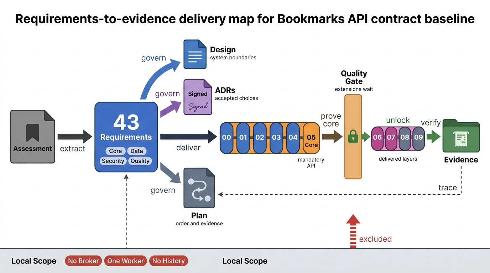

This opening image frames the work as a requirements-to-evidence delivery chain. It
shows why the mandatory API tracks must pass their quality gate before later extensions
can be treated as verified local outcomes.

### 02 — Decision and evidence controls

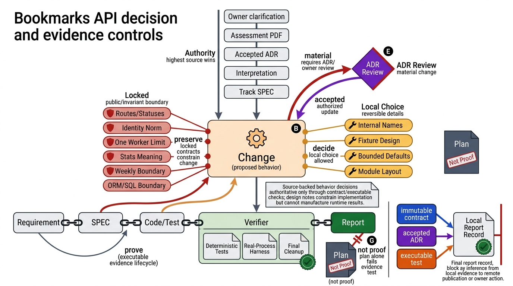

This view separates locked public contracts from reversible implementation choices. Its
central lesson is that plans, code presence, and a started process are not proof: only
executed checks with safe receipts establish evidence.

### 03 — Runtime composition

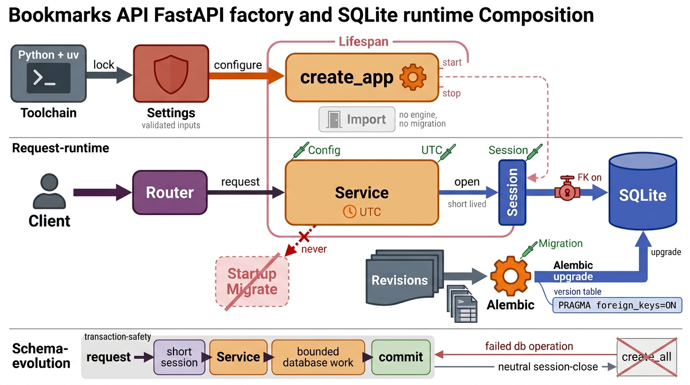

This image introduces the bounded local runtime: validated settings compose the app,
requests use short synchronous database sessions, and schema evolution stays outside
application startup. It establishes the foundation for every later HTTP interaction.

### 04 — Schema and connection guarantees

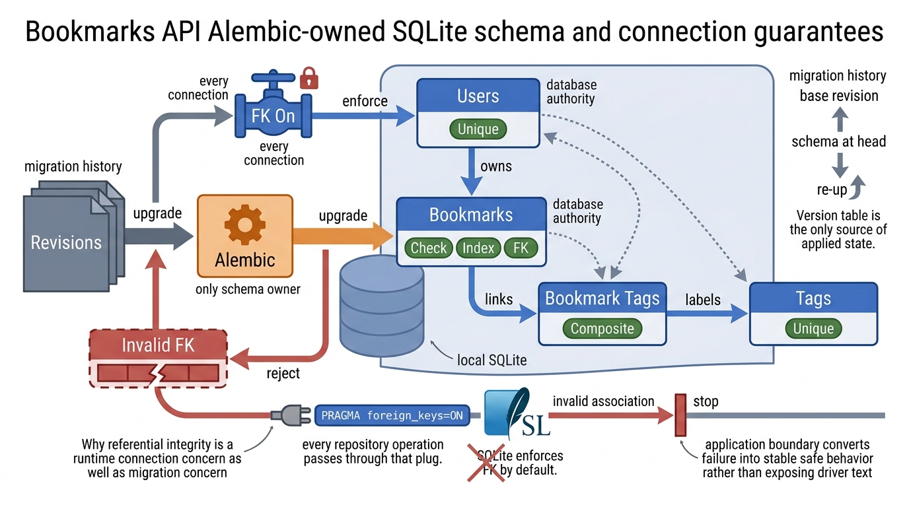

This companion view explains that data ownership and referential integrity are durable
database properties. Migrations create the schema, while each SQLite connection enables
foreign-key enforcement before application code uses it.

### 05 — Authentication boundary

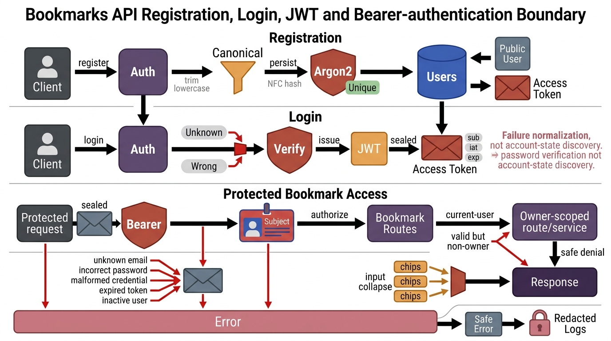

This image follows the successful security path from normalized identity and Argon2
password handling through an access-only token to a verified current subject. It makes
clear that protected bookmark operations begin only after that subject is established.

### 06 — Failure and authorization decisions

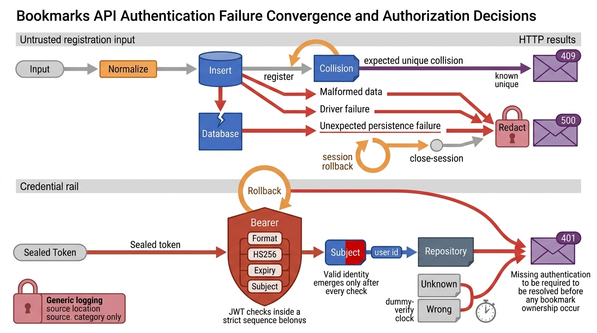

This view concentrates on negative paths. Known uniqueness conflicts are distinct from
unexpected persistence faults, and malformed, expired, or invalid credentials converge
on one safe authentication outcome without disclosing which check failed.

### 07 — Owner-scoped CRUD architecture

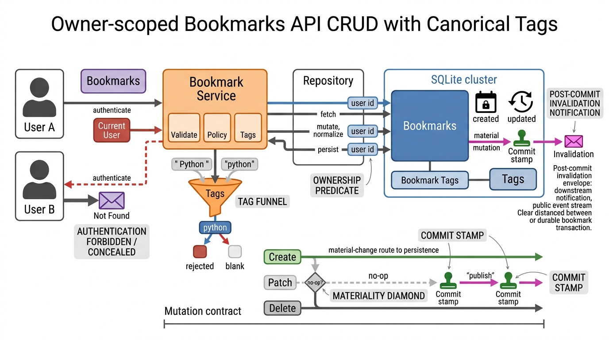

This image shows the normal bookmark path: a verified user reaches service policy and
an owner-scoped repository predicate before SQLite. It also shows canonical tag
membership and the small post-commit invalidation hint without turning it into a public
event feed.

### 08 — Mutation invariants

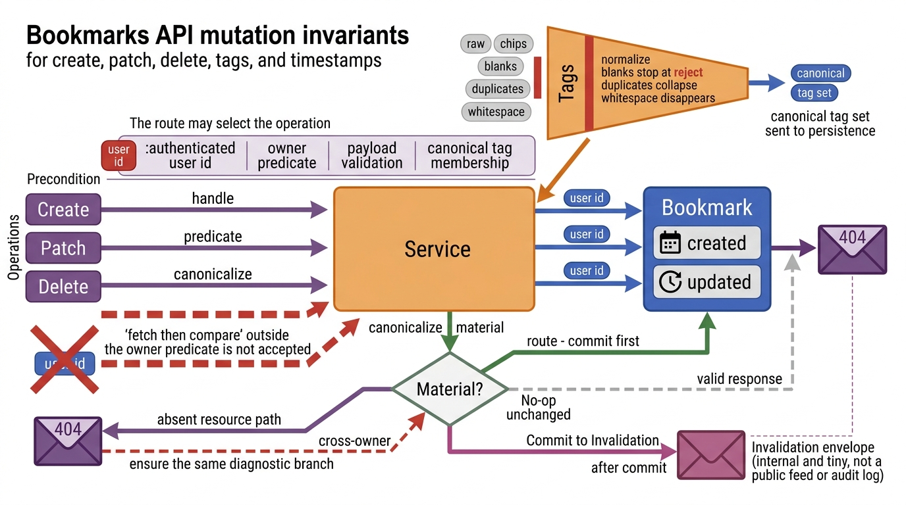

This companion isolates the state-machine rules behind CRUD. A material change commits,
updates mutable time, and may emit an after-commit hint; a semantic no-op returns with
none of those side effects. Cross-owner and missing resources remain intentionally
indistinguishable.

### 09 — Search and current statistics

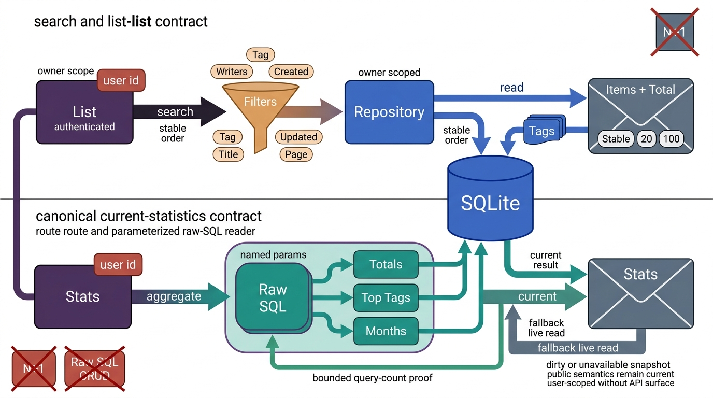

This image places list/search and all-current statistics beside one canonical data
source. Search applies shared owner-scoped filters and stable pagination, while the
statistics reader uses a deliberately narrow parameterized raw-SQL aggregate path.

### 10 — Query correctness

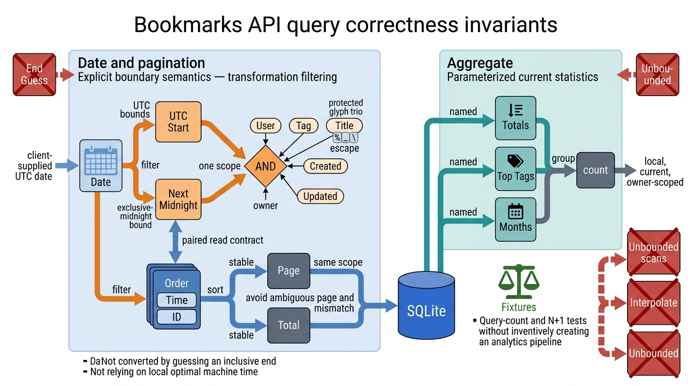

This critical view explains how calendar dates become half-open UTC bounds, why a stable
time-and-id order protects pagination, and why page rows and totals share a predicate.
It also contrasts named aggregate parameters with rejected interpolation and client-side
aggregation.

### 11 — Mandatory quality firewall

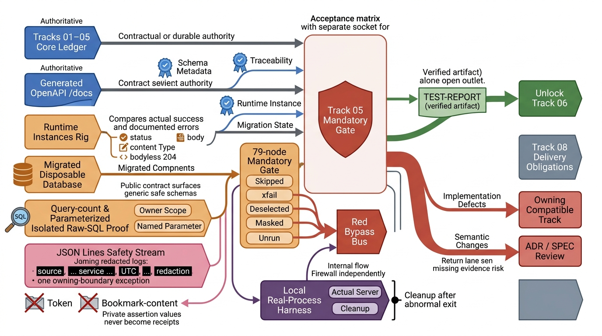

This image makes the quality gate visible as a strict boundary. Required deterministic
and real-process evidence must be complete, unmasked, and safely recorded before the
next delivery stage may proceed.

### 12 — Test-integrity mechanics

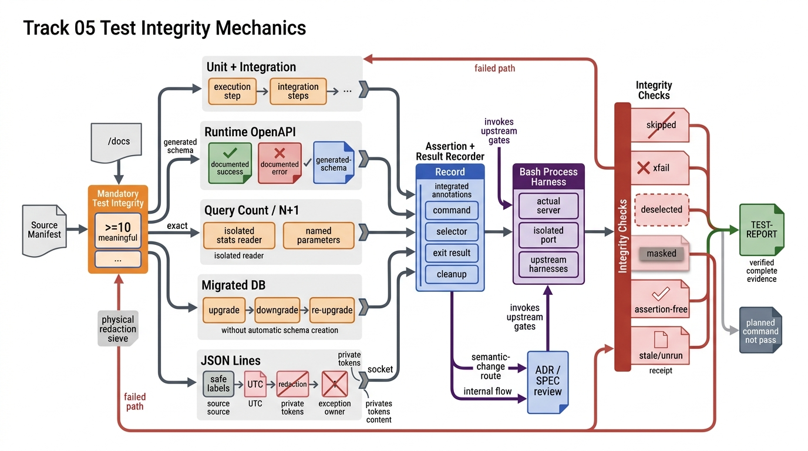

This companion looks inside the quality gate: collection, assertions, migrated database
checks, OpenAPI/runtime proof, and cleanup are separate evidence lanes. Skips, xfails,
deselection, stale results, and assertion-free checks are rejection conditions rather
than alternate successes.

### 13 — Durable invalidation architecture

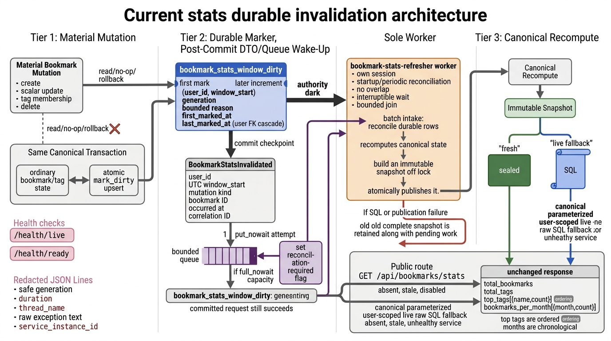

This image introduces durable dirty state for current statistics. A bookmark mutation
marks the affected window in the same transaction, while an in-memory wake-up is merely
an acceleration signal and never the authoritative record of work.

### 14 — Generation-race correctness

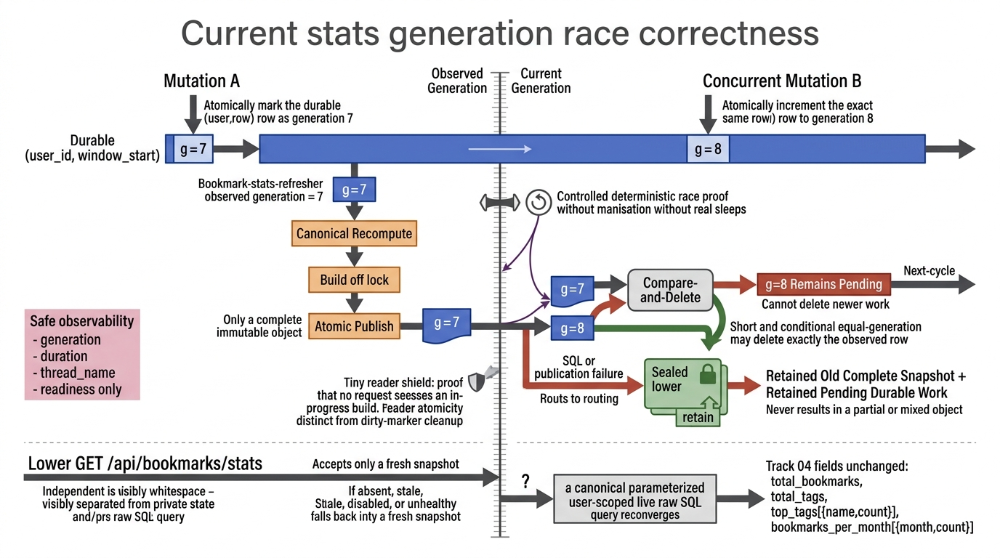

This critical view shows how a worker safely computes and acknowledges a dirty window.
The stored generation must still match at acknowledgement time; a newer mutation wins
the race, prevents a stale acknowledgement, and leaves work pending for a later pass.

### 15 — Private weekly projection architecture

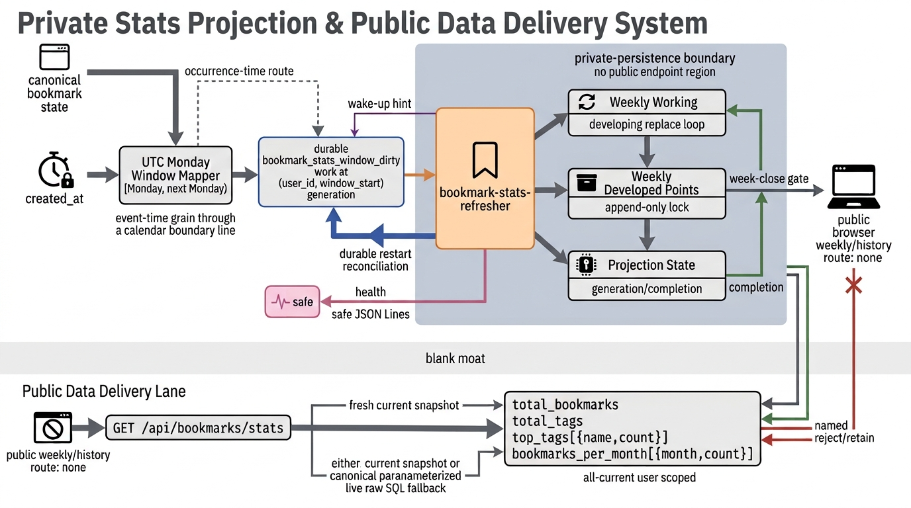

This image expands the asynchronous side into private weekly projections. The single
bounded refresher consumes durable state in UTC week windows, but it does not create a
public weekly-history API or imply a distributed worker topology.

### 16 — Corrections and dual completion

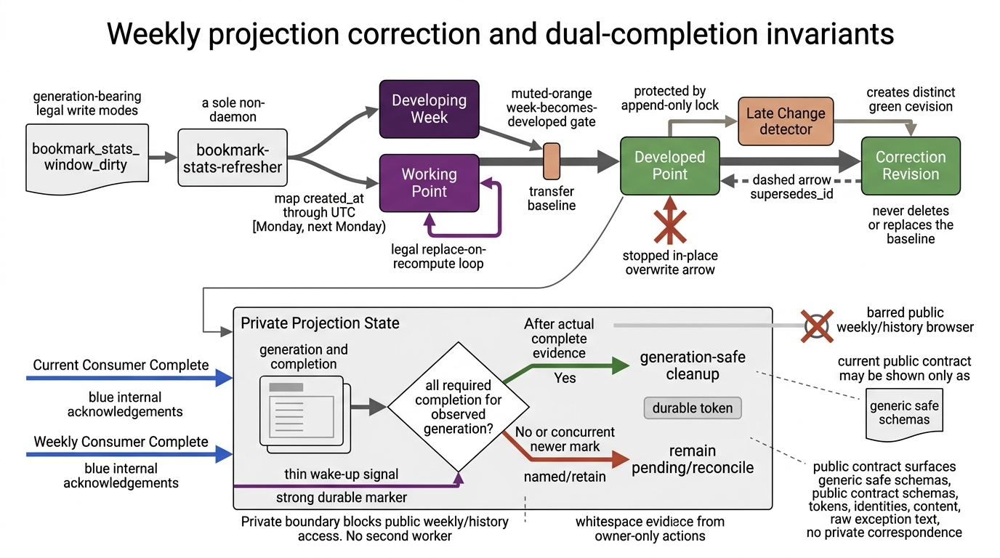

This companion distinguishes replaceable developing rows from append-only developed and
correction rows. It shows the dual-completion rule: projection data can be persisted,
but the dirty generation is complete only after the guarded acknowledgement succeeds.

### 17 — Hardening architecture

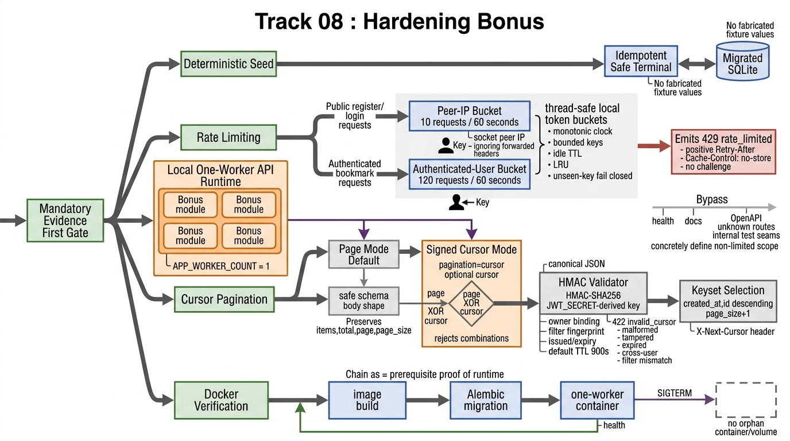

This image gathers the bounded hardening additions around the local one-worker API:
repeatable seed data, migration-first container startup, opaque signed cursors, and
local rate limiting. The modules reinforce the existing service rather than introducing
external infrastructure.

### 18 — Hardening verification decisions

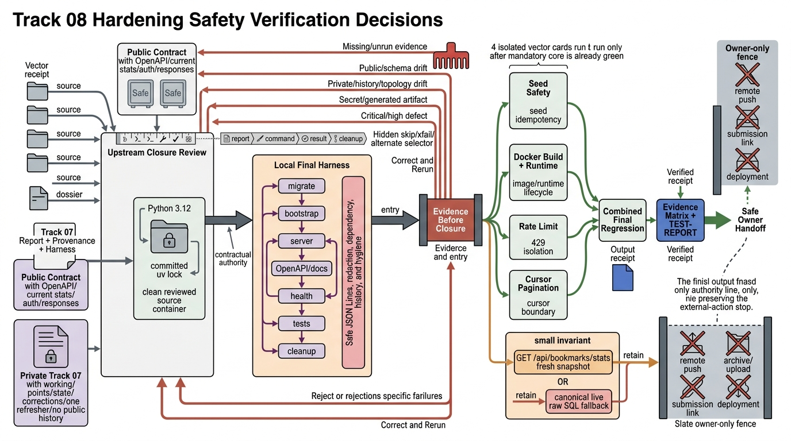

This companion emphasizes safe closure rules for the hardening work. A feature is
accepted only through its scoped checks, lifecycle cleanup, and evidence; unavailable
external capabilities and owner-only actions stay outside the local pass path.

### 19 — Modernization and evidence architecture

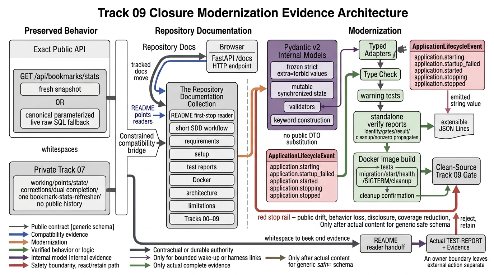

This image shows how internal modernization is constrained by preserved external
behavior. Compatibility checks bridge stronger internal models and lifecycle events to
the same public contracts, then feed a readable, safe evidence record.

### 20 — Clean-source integrity state machine

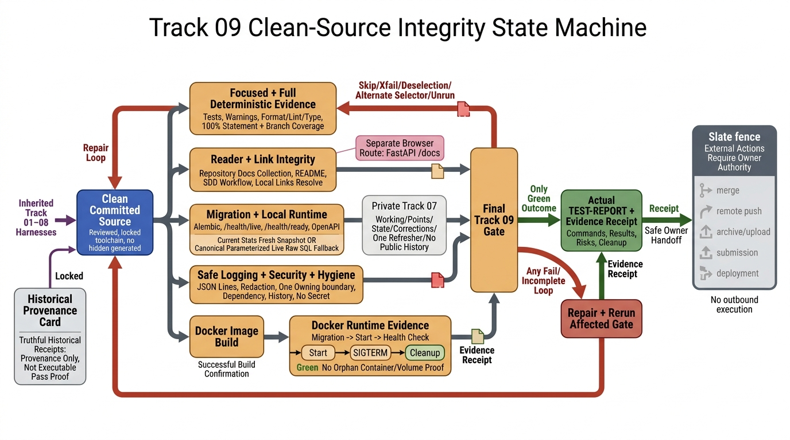

The closing image treats release evidence as a state machine. A clean committed source
must survive inherited gates, focused and full checks, runtime and container proof, and
cleanup; any drift or failure returns to repair-and-rerun rather than producing a pass.
