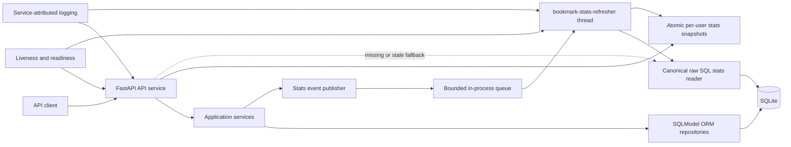

# Engineering tracks and decisions

This directory is the durable control plane for the Bookmarks API assessment. The
assessment source is stored in `../docs/Technical Assessment Senior
Software_Engineer.pdf`.

## Intent anchor

Fulfil every functional and non-functional assessment requirement with a small,
explainable backend that demonstrates correctness, security, SQL competence,
observability, test discipline, and deliberate scope control.

## Architecture

## Architecture decisions

| ADR | Status | Decision |
| --- | --- | --- |
| [ADR-001](ADR/ADR-001-application-stack-and-data-access.md) | Accepted | FastAPI, synchronous SQLModel, SQLite, Alembic, constraints, and ORM/raw-SQL boundary |
| [ADR-002](ADR/ADR-002-api-contract-and-timestamps.md) | Accepted | REST contract, filters, PATCH semantics, tag normalization, and timestamp behavior |
| [ADR-003](ADR/ADR-003-identity-and-token-security.md) | Accepted | Identity normalization, password hashing, and access-only JWTs |
| [ADR-004](ADR/ADR-004-event-driven-statistics-service.md) | Accepted | Queue-driven periodic statistics service, snapshots, health, bootstrap, and logs |
| [ADR-005](ADR/ADR-005-windowed-statistics-data-points.md) | Accepted | Developing-window recalculation and append-only corrected historical revisions |

## Planned delivery tracks

| Order | Track | Depends on | State |
| --- | --- | --- | --- |
| 00 | Contract and ADR baseline | None | Complete |
| 01 | Foundation, configuration, schema, and migrations | 00 | Ready |
| 02 | Error contract, registration, login, and JWT authentication | 01 | Pending |
| 03 | Bookmark CRUD, tag relationships, and ownership isolation | 01, 02 | Pending |
| 04 | Search, date filters, pagination, and raw-SQL statistics | 03 | Pending |
| 05 | Mandatory OpenAPI, integration tests, and quality gate | 02-04 | Pending |
| 06 | Event queue, durable dirty recovery, current snapshots, health, and observability | 05 | Pending |
| 07 | Weekly developing points and append-only correction revisions | 06 | Pending |
| 08 | Final regression, README, deployment design, seed data, and optional bonuses | 01-07 | Pending |

Detailed `SPEC.md`, `PLAN.md`, and `HISTORY.md` artifacts will be created for a
track immediately before that track begins. Decisions that change observable
behavior require an ADR update before implementation.
