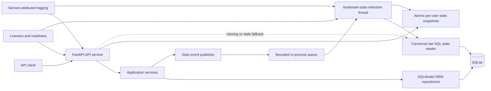

# Engineering tracks and decisions

This directory is the durable control plane for the Bookmarks API assessment. The
assessment source is stored in `../docs/Technical Assessment Senior
Software_Engineer.pdf`.

## Intent anchor

Fulfil every functional and non-functional assessment requirement with a small,
explainable backend that demonstrates correctness, security, SQL competence,
observability, test discipline, and deliberate scope control.

## Architecture

## Architecture decisions

| ADR | Status | Decision |
| --- | --- | --- |
| [ADR-001](ADR/ADR-001-application-stack-and-data-access.md) | Accepted | FastAPI, synchronous SQLModel, SQLite, Alembic, constraints, and ORM/raw-SQL boundary |
| [ADR-002](ADR/ADR-002-api-contract-and-timestamps.md) | Accepted | REST contract, filters, PATCH semantics, tag normalization, and timestamp behavior |
| [ADR-003](ADR/ADR-003-identity-and-token-security.md) | Accepted | Identity normalization, password hashing, and access-only JWTs |
| [ADR-004](ADR/ADR-004-event-driven-statistics-service.md) | Accepted | Queue-driven periodic statistics service, snapshots, health, bootstrap, and logs |
| [ADR-005](ADR/ADR-005-windowed-statistics-data-points.md) | Accepted | Developing-window recalculation and append-only corrected historical revisions |
| [ADR-006](ADR/ADR-006-engineering-verification-and-closure-evidence.md) | Accepted | Binding engineering verification, evidence, and closure process |

## Planned delivery tracks

| Order | Track | Depends on | State |
| --- | --- | --- | --- |
| 00 | Contract and ADR baseline | None | Complete |
| 01 | Foundation, configuration, schema, and migrations | 00 | Complete |
| 02 | Error contract, registration, login, and JWT authentication | 01 | Complete |
| 03 | Bookmark CRUD, tag relationships, and ownership isolation | 01, 02 | Complete |
| 04 | Search, date filters, pagination, and raw-SQL statistics | 03 | Planned (implementation-gated) |
| 05 | Mandatory OpenAPI, integration tests, and quality gate | 02-04 | Planned (implementation-gated) |
| 06 | Event queue, durable dirty recovery, current snapshots, health, and observability | 05 | Planned (implementation-gated) |
| 07 | Weekly developing points and append-only correction revisions | 06 | Planned (implementation-gated) |
| 08 | Final hardening, documentation, assessment handoff, and optional bonuses | 01, 02, 03, 04, 05, 06, 07 | Planned (implementation-gated) |

Detailed `SPEC.md`, `PLAN.md`, and `HISTORY.md` artifacts may be created
sequentially after review of upstream plans, so a downstream track can be prepared
without waiting to repeat discovery. Their presence records planning only: a track is
implementation-ready only when its stated upstream implementation and closure gates
are satisfied. Decisions that change observable behavior require an ADR update before
implementation.

Track completion uses the shared
[engineering verification guideline](../docs/ENGINEERING-VERIFICATION-GUIDELINE.md):
Complete means the track's recorded evidence actually passed. Planned, Ready, and
Blocked states are not completion, and executable tracks also require their
deterministic tests and real-process harness evidence.

### Detailed planned artifacts

- [Track 02 specification](02-auth-errors/SPEC.md)
- [Track 02 execution plan](02-auth-errors/PLAN.md)
- [Track 02 history](02-auth-errors/HISTORY.md)
- [Track 03 specification](03-bookmark-crud/SPEC.md)
- [Track 03 execution plan](03-bookmark-crud/PLAN.md)
- [Track 03 history](03-bookmark-crud/HISTORY.md)
- [Track 03 test report](03-bookmark-crud/TEST-REPORT.md)
- [Track 04 specification](04-search-stats/SPEC.md)
- [Track 04 execution plan](04-search-stats/PLAN.md)
- [Track 04 history](04-search-stats/HISTORY.md)
- [Track 05 specification](05-mandatory-quality-gate/SPEC.md)
- [Track 05 execution plan](05-mandatory-quality-gate/PLAN.md)
- [Track 05 history](05-mandatory-quality-gate/HISTORY.md)
- [Track 06 specification](06-event-driven-stats/SPEC.md)
- [Track 06 execution plan](06-event-driven-stats/PLAN.md)
- [Track 06 history](06-event-driven-stats/HISTORY.md)
- [Track 07 specification](07-weekly-projections/SPEC.md)
- [Track 07 execution plan](07-weekly-projections/PLAN.md)
- [Track 07 history](07-weekly-projections/HISTORY.md)
- [Track 08 specification](08-final-handoff/SPEC.md)
- [Track 08 execution plan](08-final-handoff/PLAN.md)
- [Track 08 history](08-final-handoff/HISTORY.md)
