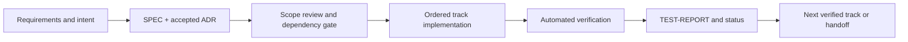

# Bookmarks API



An authenticated local bookmark-management service for the supplied backend assessment.
It offers registration and login, owner-scoped bookmark CRUD and search, current
statistics, liveness/readiness checks, deterministic development seeding, local rate
limiting, signed cursor pagination, and private weekly event-time projections with
append-only correction revisions. It is a deliberately bounded modular monolith:
FastAPI maps HTTP to services, SQLModel repositories access SQLite, Alembic owns schema
changes, and a single in-process worker refreshes current-statistics snapshots and the
private weekly projection.

## What is delivered—and what is not

The public OpenAPI contract has exactly **10 operations** and **45 documented
operation/status pairs**. It preserves owner isolation, stable redacted errors,
canonical UTC behavior, page and cursor pagination, and canonical raw-SQL current
statistics when a snapshot is unavailable or stale. The requirement map contains
**43 assessment IDs**; detailed traceability lives in
[the assessment interpretation](.docs/ASSESSMENT.md) and
[the track evidence](.tracks/README.md).

This is not a production topology. It intentionally uses local SQLite, one Uvicorn
worker, process-local snapshots/queue/rate state, and HS256 JWTs. It does not provide
PostgreSQL, Redis or a broker, multi-worker coordination, or a public weekly-history
API. Track 07 is **Complete** under ADR-009: the weekly working rows, immutable point
revisions, restartable baseline, correction consumer, readiness integration, and
executable verifier are delivered without adding an eleventh public operation.

## Run locally

Use Python **3.12**, [uv](https://docs.astral.sh/uv/), and Git. Docker is required only
for Docker verification. The committed lock requires Python `>=3.12,<3.13`.

```sh
git clone <repository-url>
cd backend-sample
uv sync --locked
make migrate
make bootstrap
```

The default service listens on `127.0.0.1:8000`. Browse `/docs`, inspect
`/openapi.json`, and check `/health/live` and `/health/ready`. `make run` starts only
the API after migration; `make bootstrap` migrates first. `.env.example` documents
environment variables but is not loaded automatically. Never commit a `.env` file or a
usable secret.

To seed an explicitly named disposable development database after migration:

```sh
DATABASE_URL=sqlite:////absolute/path/bookmarks-dev.sqlite3 \
  APP_ENV=development uv run python -m app.seed
```

The seed command never creates schema or deletes data. It rejects unsafe targets,
requires this checkout's Alembic head, is idempotent for its fixed fictional fixture,
and rolls back on a conflicting fixture identity.

## API at a glance

All `/api/bookmarks` routes require a bearer token obtained from login.

| Method | Path | Purpose |
| --- | --- | --- |
| POST | `/api/auth/register` | Register a user. |
| POST | `/api/auth/login` | Obtain an access token. |
| POST | `/api/bookmarks` | Create an owned bookmark. |
| GET | `/api/bookmarks` | List or search owned bookmarks. |
| GET | `/api/bookmarks/stats` | Return current owner-scoped statistics. |
| GET | `/api/bookmarks/{bookmark_id}` | Read one owned bookmark. |
| PATCH | `/api/bookmarks/{bookmark_id}` | Apply a material owned update. |
| DELETE | `/api/bookmarks/{bookmark_id}` | Delete one owned bookmark (204, no body). |
| GET | `/health/live` | Report local process liveness. |
| GET | `/health/ready` | Report database and internal-service readiness. |

List/search supports normalized tags, title substring, created/updated UTC date ranges,
and page pagination. Cursor mode (`pagination=cursor`) uses an opaque signed,
owner/filter-bound `X-Next-Cursor` token while retaining the same response body. Current
statistics report `X-Stats-Source: snapshot` only for a trustworthy fresh snapshot;
otherwise they use the canonical live SQL path. See the
[solution design](.docs/SOLUTION-DESIGN.md) for exact request, response, and invariant
details.

## Functional reports and verification

Each verification script prints a standalone formatted terminal report: script identity,
selected gates, pass/fail/incomplete outcome, useful summaries, and cleanup result. Run the
documentation and completed-track receipts directly:

```sh
bash scripts/verify-docs.sh
bash scripts/verify-testing-reports.sh
bash scripts/verify-track-01.sh
bash scripts/verify-track-02.sh
bash scripts/verify-track-03.sh
bash scripts/verify-track-04.sh
bash scripts/verify-track-05.sh
bash scripts/verify-track-06.sh
bash scripts/verify-track-07.sh
bash scripts/verify-track-08.sh
bash scripts/verify-track-09.sh
```

Track 07's latest continuous receipt passed 865 tests plus 3 subtests, 100% branch
coverage over 3,932 statements and 910 branches, migrations, and six real-process
projection phases. Track 08's clean-source/Docker integration receipt passed those same
full counts after invoking exact Tracks 01–07. Track 09's current clean committed branch
gate now passes 867 tests plus 3 subtests, 3,932 statements and 910 branches at 100%,
exact inherited runtime/Docker evidence, and verified cleanup. Independent review,
the non-fast-forward merge, and the exact clean merged-main rerun also passed; Track 09
is Ready to push.
A dirty/non-clean source is a **failure**; explicit development
seams and an unavailable Docker daemon are nonzero **incomplete** results, never pass.

The pre-revival Track 09 evidence was **743 tests plus 3 subtests** and
**2,953 statements / 618 branches at 100% coverage**. The exact commands, receipts,
and merged-main receipt remain recorded as historical evidence in the
[Track 09 plan](.tracks/09-final-cleanup-docs/PLAN.md) and
[test report](.tracks/09-final-cleanup-docs/TEST-REPORT.md); they are not current
Track 07 integration proof.

The committed [testing-report manifest](.testing_report/MANIFEST.md) indexes ten safe
public terminal receipts from the current Track 08 integration source. Track 07 records
its executable harness with PASS/exit-0 evidence; the obsolete owner-skip receipt is absent.

For ordinary local checks:

```sh
uv run ruff format --check .
uv run ruff check .
uv run mypy app
uv run pyright app
uv run pytest -q
uv run coverage run --branch -m pytest -q && uv run coverage report --fail-under=100
```

## Docker verification

Docker is a local delivery path, not a deployed environment. Build and run it with an
explicit named volume and runtime configuration:

```sh
docker build -t bookmarks-api:local .
docker volume create bookmarks-api-data
docker run --rm -p 8000:8000 -v bookmarks-api-data:/data \
  -e APP_ENV=development \
  -e DATABASE_URL=sqlite:////data/bookmarks.sqlite3 \
  -e JWT_SECRET='replace-with-a-local-development-secret' \
  bookmarks-api:local
```

Use `migrate-only` as the final image argument to run Alembic and exit. The container
contract is non-root, one worker, `/data` volume, `/health/live` health check, JSON Lines
lifecycle logs, and cooperative `SIGTERM` handling. Track 08's refreshed ordered build,
runtime, and cleanup receipt passes, and the current clean-source Track 09 branch gate
has inherited and passed that exact Docker evidence. Independent review, merge, and
the merged-main rerun passed; only the explicitly approved push remains.

## Architecture and security

Passwords use Argon2; access tokens are HS256 JWTs; protected reads and writes are
owner-scoped; expected failures use stable redacted envelopes; and application logs are
JSON Lines with redaction and bounded exception evidence. The background refresher is
lifespan-owned, named, non-daemon, and cooperative on shutdown. Canonical SQL remains
the statistics correctness path; the queue and snapshots only improve freshness.

Track 09 modernizes internal values to strict Pydantic v2 models, retains FastAPI's
current `@asynccontextmanager` lifespan pattern, represents the five application
lifecycle names with `StrEnum`, and adds pinned standard-mode Pyright validation. The
current supported `httpx2` TestClient dependency includes a public response adapter for
Schemathesis compatibility; it does not change API bodies or OpenAPI. Narrow SQLModel
metaclass typing boundaries are documented rather than hidden with broad suppressions.

## Status and detailed evidence

| Track | Status |
| --- | --- |
| 00 | Complete — contract baseline and traceability. |
| 01 | Complete — foundation, configuration, schema, and migrations. |
| 02 | Complete — errors, identity, and authentication. |
| 03 | Complete — CRUD, tags, and owner isolation. |
| 04 | Complete — search and current raw-SQL statistics. |
| 05 | Complete — mandatory quality and OpenAPI gate. |
| 06 | Complete — event-driven current snapshots, health, and observability. |
| 07 | Complete — private weekly projections, corrections, readiness, and executable evidence. |
| 08 | Complete — clean-source/Docker integration passed with completed Track 07. |
| 09 | Ready to push — branch review, merge, and exact merged-main gate passed. |

Use [.docs](.docs/README.md) for reader-facing assessment, design, delivery, walkthrough,
and handoff material; use [.tracks](.tracks/README.md) for accepted ADRs, specifications,
plans, histories, and evidence reports. The [release handoff](.docs/RELEASE-HANDOFF.md)
holds completed repository evidence and the external-action boundary. External push,
archive, sharing, deployment, and submission remain repository-owner actions.
